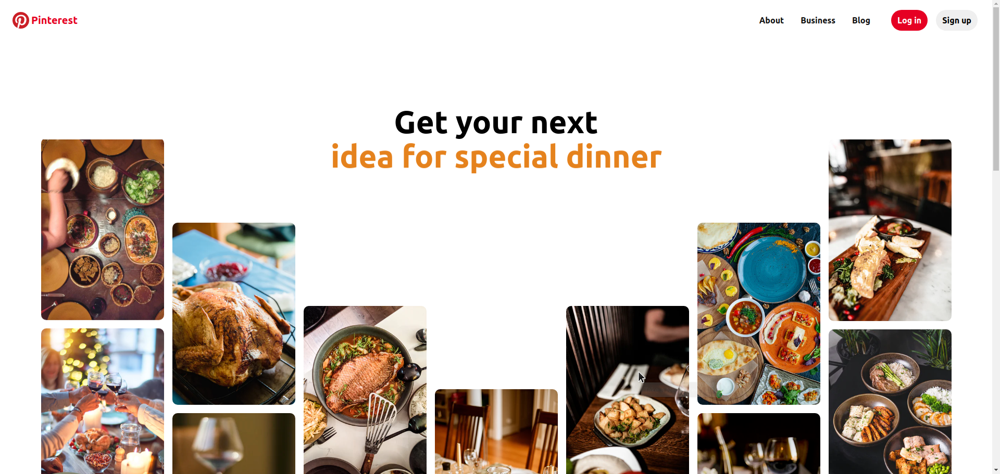

<h1 align="center">
UI Clone - Pinterest (Homepage)
</h1>

<a href="https://pinterest.com">Pinterest Homepage</a> UI clone for study purposes.

  

## Resources

- [x] HTML, SCSS, JS
- [x] SVG Images

